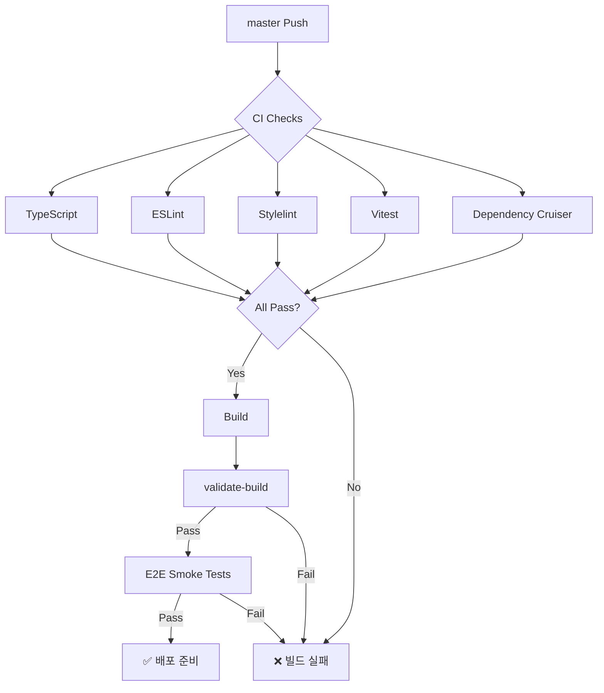

# 코드 품질 점검 도구 가이드

> **목적**: 프로젝트의 코드 품질을 유지하기 위한 점검 도구들의 역할과 사용법
> **최종 업데이트**: 2025-10-26 | **상태**: 현재 0 violations ✅

## 점검 도구 책임 분리

### 1. CodeQL (정적 보안 및 패턴 분석)

**책임**: 코드베이스의 보안 취약점과 아키텍처 패턴 위반 감지

**범위**:

- 프로젝트 특화 코딩 규칙 위반 (vendor imports, touch events, 디자인 토큰)
- 보안 패턴 (안전하지 않은 다운로드, eval 사용)
- 안티패턴 (console.log, debugger 남용)

**실행 시점**:

- **로컬**: `npm run codeql:check` (선택적 - CodeQL CLI 설치 필요)
- **CI**: GitHub Actions Security 워크플로우 (자동)

**결과 해석**:

- **Error**: 즉시 수정 필요 (커밋 전 수정)
- **Warning**: 수정 권장

**관련 파일**:

- `codeql-custom-queries-javascript/*.ql`
- `scripts/check-codeql.js`
- `.github/workflows/security.yml`

---

### 2. ESLint (코드 스타일 및 베스트 프랙티스)

**책임**: JavaScript/TypeScript 코드 스타일과 일반적인 베스트 프랙티스 검증

**범위**:

- 코드 포맷팅 규칙
- 사용하지 않는 변수/import
- 일반적인 버그 패턴
- Solid.js 특화 규칙

**실행 시점**:

- **로컬**: `npm run lint:fix` (자동 수정 포함)
- **CI**: 모든 PR에서 자동 실행
- **Pre-commit**: lint-staged로 변경된 파일만 검사

**결과 해석**:

- 모든 경고는 자동 수정되거나 수동 수정 필요
- `--max-warnings 0` 정책: 경고도 허용하지 않음

**관련 파일**:

- `eslint.config.js`
- `.github/workflows/ci.yml`

---

### 3. Stylelint (CSS 품질)

**책임**: CSS 코드 스타일과 디자인 시스템 규칙 검증

**범위**:

- CSS 문법 및 포맷팅
- 디자인 토큰 사용 규칙
- 색상/크기 하드코딩 금지
- 일관된 단위 사용

**실행 시점**:

- **로컬**: `npm run lint:css:fix`
- **CI**: 모든 PR에서 자동 실행

**결과 해석**:

- 모든 경고는 즉시 수정 필요
- 디자인 토큰 위반은 우선순위 높음

**관련 파일**:

- `.stylelintrc.json`
- `src/shared/styles/design-tokens*.css`

---

### 4. TypeScript Compiler (타입 안전성)

**책임**: TypeScript 타입 시스템 검증 및 컴파일 오류 감지

**범위**:

- 타입 오류 감지
- strict 모드 규칙 (null check, any 사용 등)
- 인터페이스 일치 검증
- tsconfig 규칙 준수

**실행 시점**:

- **로컬**: `npm run typecheck`
- **CI**: 모든 PR에서 자동 실행

**결과 해석**:

- 0 errors 필수 (컴파일 차단)
- strict 모드 유지 필수

**관련 파일**:

- `tsconfig.json`
- `tsconfig.base.json`
- `tsconfig.tests.json`

---

### 5. Vitest (단위/통합 테스트)

**책임**: 코드 동작의 정확성 검증

**범위**:

- 단위 테스트 (함수, 컴포넌트 레벨)
- 통합 테스트 (서비스 간 상호작용)
- 커버리지 측정 (v8)

**실행 시점**:

- **로컬**: `npm test` (fast), `npm run test:coverage` (커버리지)
- **CI**: Node 22/24에서 각각 실행

**결과 해석**:

- 95% 이상 통과율 유지
- 실패 테스트는 즉시 수정 또는 이슈 등록

**관련 파일**:

- `vitest.config.ts`
- `test/**/*.test.ts`

---

### 6. Playwright (E2E 테스트)

**책임**: 실제 브라우저 환경에서 사용자 시나리오 검증

**범위**:

- 갤러리 열기/닫기
- 키보드 네비게이션
- 다운로드 기능
- 설정 변경

**실행 시점**:

- **로컬**: `npm run e2e:smoke`
- **CI**: master 브랜치 push 시

**결과 해석**:

- 스모크 테스트 실패 시 즉시 수정
- 스크린샷 diff 검토

**관련 파일**:

- `playwright.config.ts`
- `playwright/smoke/**/*.spec.ts`

---

### 7. Dependency Cruiser (의존성 규칙)

**책임**: 아키텍처 경계와 의존성 규칙 검증

**범위**:

- 3계층 아키텍처 준수 (Features → Shared → External)
- 순환 의존성 감지
- 금지된 import 패턴
- 모듈 결합도

**실행 시점**:

- **로컬**: `npm run deps:check`
- **CI**: 빌드 전 자동 실행

**결과 해석**:

- 0 violations 필수
- 경고도 허용하지 않음

**관련 파일**:

- `.dependency-cruiser.cjs`
- `docs/ARCHITECTURE.md`

---

### 8. validate-build.js (빌드 결과물 검증)

**책임**: 빌드 산출물의 품질과 크기 검증

**범위**:

- 번들 크기 제한 (325 KB dev, 335 KB prod)
- 필수 파일 존재 확인
- 메타데이터 유효성
- userscript 헤더 검증

**실행 시점**:

- **로컬**: `npm run build` 후 자동 실행 (postbuild)
- **CI**: 릴리즈 워크플로우

**결과 해석**:

- 빌드 크기 초과 시 Phase 81 활성화
- 필수 헤더 누락 시 빌드 실패

**관련 파일**:

- `scripts/validate-build.js`
- `package.json` (postbuild)

---

### 9. maintenance-check.js (프로젝트 정리)

**책임**: 프로젝트 구조와 파일 상태 점검

**범위**:

- 백업/임시 디렉터리 감지
- 큰 문서 파일 (500줄+)
- Git 추적되지 않는 파일
- 보안 취약점 (npm audit)
- 사용하지 않는 의존성 (depcheck)
- 빌드 크기 모니터링

**실행 시점**:

- **로컬**: `npm run maintenance:check` (작업 완료 시)
- **CI**: 주간 스케줄 (maintenance.yml)

**결과 해석**:

- 조치 필요 항목은 사용자에게 명령어와 함께 제공
- 정기적인 정리 권장

**관련 파일**:

- `scripts/maintenance-check.js`
- `.github/workflows/maintenance.yml`

---

## 통합 워크플로우

### 로컬 개발 워크플로우

```bash
# 1. 개발 시작 전
npm run validate          # 전체 검증 (typecheck + lint + format)

# 2. 코드 작성 중
npm run lint:fix         # ESLint 자동 수정
npm run typecheck        # 타입 오류 확인
npm test                 # 관련 테스트 실행

# 3. 작업 완료 시
npm run validate         # 전체 검증
npm run build            # 빌드 + validate-build 자동 실행
npm run maintenance:check # 프로젝트 정리 점검

# 4. 커밋 시 (자동)
# - lint-staged가 변경된 파일만 린트
# - commitlint가 커밋 메시지 검증
```

### CI 워크플로우



### 주기별 점검

**매일 (자동 - pre-commit hook)**:

- ESLint
- TypeScript
- 단위 테스트 (변경된 파일 관련)

**PR마다 (CI)**:

- 전체 린트 + 타입체크
- 전체 테스트
- 의존성 규칙
- 빌드 검증

**주간 (자동 - GitHub Actions schedule)**:

- 보안 취약점 스캔
- 라이센스 컴플라이언스
- 의존성 업데이트 확인
- 프로젝트 정리 (maintenance-check)

**월간 (수동 권장)**:

- 큰 문서 분할 검토
- 사용하지 않는 코드 제거
- 의존성 업그레이드

---

## 점검 결과 해석 가이드

### 우선순위 1 (즉시 수정)

- TypeScript 컴파일 오류
- CodeQL Error 레벨
- 실패한 테스트
- 의존성 규칙 위반
- 빌드 검증 실패

### 우선순위 2 (커밋 전 수정)

- ESLint/Stylelint 경고
- CodeQL Warning 레벨
- 빌드 크기 90% 초과
- 보안 취약점 (moderate+)

### 우선순위 3 (검토 후 판단)

- Maintenance-check 경고
- 큰 문서 파일
- 사용하지 않는 의존성

---

## FAQ

**Q: CodeQL이 로컬에서 실행되지 않아요.** A: CodeQL CLI는 선택적 도구입니다.
CI에서 자동으로 실행되므로 로컬 설치는 필수가 아닙니다. 설치를 원하면
[GitHub CLI를 사용](https://cli.github.com/)하거나
[직접 다운로드](https://github.com/github/codeql-cli-binaries/releases)하세요.

**Q: 테스트가 너무 느려요.** A: `npm run test:fast`를 사용하면 빠른 테스트만
실행됩니다. CI에서는 전체 테스트가 실행됩니다.

**Q: 빌드 크기가 초과되면 어떻게 하나요?** A: 330 KB 도달 시 Phase 81(번들
최적화)이 트리거됩니다. `docs/TDD_REFACTORING_PLAN.md`를 참고하세요.

**Q: maintenance-check의 경고를 무시해도 되나요?** A: 일부는 무시 가능하지만,
백업 디렉터리나 추적되지 않는 파일은 정기적으로 정리하는 것이 좋습니다.

**Q: 모든 점검을 한 번에 실행하려면?** A:
`npm run validate && npm run maintenance:check`를 실행하세요. 작업 완료 시
권장합니다.

---

## 관련 문서

- [ARCHITECTURE.md](./ARCHITECTURE.md): 3계층 아키텍처 설명
- [CODING_GUIDELINES.md](./CODING_GUIDELINES.md): 코딩 규칙 상세
- [TESTING_STRATEGY.md](./TESTING_STRATEGY.md): 테스트 전략
- [MAINTENANCE.md](./MAINTENANCE.md): 유지보수 체크리스트
- [TDD_REFACTORING_PLAN.md](./TDD_REFACTORING_PLAN.md): 현재 Phase 계획
