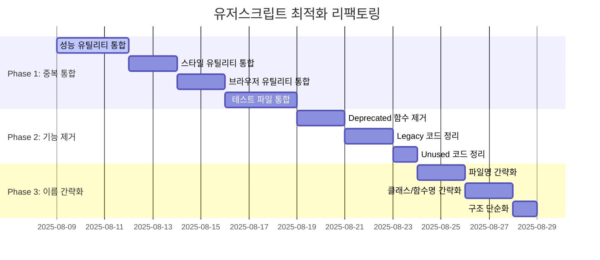

# 🎯 TDD 기반 리팩토링 실행 계획

## 📋 전체 로드맵 (3-4주)



## 🔴 Phase 1: 중복 구현 통합 (1-2주, 우선순위: HIGH)

### Week 1-1: 성능 유틸리티 통합 TDD

#### 🔴 RED: 기존 기능 보장 테스트

```typescript
// test/refactoring/performance-integration.test.ts
describe('성능 유틸리티 통합 TDD', () => {
  describe('RED: 기존 기능 보장', () => {
    it('debounce 함수들이 모두 동일하게 작동해야 함', () => {
      // 3개소의 debounce 함수 동작 검증
    });

    it('throttle 함수들이 모두 동일하게 작동해야 함', () => {
      // 3개소의 throttle 함수 동작 검증
    });
  });
});
```

#### 🟢 GREEN: 통합 구현

```typescript
// src/shared/utils/performance.ts (새로 생성)
export class Performance {
  static debounce = <T extends (...args: unknown[]) => void>(
    fn: T,
    delay: number
  ) => {
    /* 통합된 구현 */
  };

  static throttle = <T extends (...args: unknown[]) => void>(
    fn: T,
    delay: number
  ) => {
    /* 통합된 구현 */
  };
}
```

#### 🔵 REFACTOR: 기존 import 경로 업데이트

```typescript
// 기존 파일들에서 통합된 모듈로 변경
import { Performance } from '@shared/utils/performance';
```

### Week 1-2: 스타일 유틸리티 통합 TDD

#### 🔴 RED: 스타일 함수 호환성 테스트

```typescript
describe('스타일 유틸리티 통합', () => {
  it('모든 setCSSVariable 함수가 동일 결과를 반환해야 함', () => {
    // @deprecated 함수와 신규 함수 비교 검증
  });
});
```

#### 🟢 GREEN: 단일 진입점 생성

```typescript
// src/shared/utils/styles.ts
export {
  setCSSVariable,
  getCSSVariable,
  setCSSVariables,
} from '@shared/styles/style-service';
```

### Week 1-3: 테스트 파일 통합

#### 🔴 RED: 테스트 커버리지 보장

```bash
# 통합 전 커버리지 측정
npm run test:coverage -- --dir test/unit/shared/services
```

#### 🟢 GREEN: 중복 테스트 통합

```typescript
// test/unit/shared/services/zindex.consolidated.test.ts
// ZIndexManager + ZIndexService 테스트 통합

// test/unit/shared/services/core.consolidated.test.ts
// ServiceManager + CoreService 테스트 통합

// test/unit/shared/logging/logger.consolidated.test.ts
// 3개의 logger 안전성 테스트 통합
```

## 🟡 Phase 2: 사용하지 않는 기능 제거 (1주, 우선순위: MEDIUM)

### Week 2-1: Deprecated 함수 제거 TDD

#### 🔴 RED: Breaking Changes 감지

```typescript
describe('Deprecated 함수 제거', () => {
  it('deprecated 함수 사용처가 모두 대체되었는지 확인', () => {
    // 정적 분석으로 @deprecated 함수 사용 검사
  });
});
```

#### 🟢 GREEN: 안전한 제거

```bash
# @deprecated 함수들 제거
- setCSSVariable (utils.ts의 deprecated 버전)
- createRafThrottle (성능 유틸리티 deprecated 버전)
```

### Week 2-2: Legacy 코드 정리

#### 🔴 RED: Legacy 의존성 체크

```typescript
describe('Legacy 코드 제거', () => {
  it('LEGACY_ANIMATION_DURATION 상수가 사용되지 않는지 확인', () => {
    // grep으로 사용처 검색 및 검증
  });
});
```

## 🔵 Phase 3: 이름 간략화 및 구조 개선 (1주, 우선순위: LOW)

### Week 3-1: 파일명 간략화

#### 🔴 RED: Import 경로 호환성 테스트

```typescript
describe('파일명 변경 호환성', () => {
  it('모든 import 경로가 올바르게 해결되어야 함', () => {
    // TypeScript 컴파일 검사
  });
});
```

#### 🟢 GREEN: 단계적 이름 변경

```bash
# 파일명 간략화
unified-performance-utils.ts → performance.ts
deduplication-utils.ts → dedupe.ts
optimization-utils.ts → optimize.ts
```

### Week 3-2: 클래스/함수명 간략화

```typescript
// Before
class PerformanceUtils {
  static createLazyLoader = ...
  static removeDuplicates = ...
}

// After
class Performance {
  static lazyLoad = ...
  static dedupe = ...
}
```

## ✅ 검증 기준

### 자동화된 검증

```json
{
  "번들_크기_감소": "최소 10%",
  "테스트_통과율": "100%",
  "TypeScript_에러": "0개",
  "ESLint_경고": "기존 대비 50% 감소"
}
```

### 수동 검증 체크리스트

- [ ] 갤러리 기본 기능 정상 작동
- [ ] 설정 페이지 정상 작동
- [ ] 성능 최적화 기능 정상 작동
- [ ] 브라우저 호환성 유지

## 🚨 리스크 관리

### 롤백 전략

```bash
# 각 단계마다 안전 지점 생성
git commit -m "feat: Phase 1.1 - 성능 유틸리티 통합 완료"
git tag refactor-checkpoint-1.1
```

### CI/CD 파이프라인 검증

```yaml
# .github/workflows/refactoring-check.yml
- name: 번들 크기 체크
  run: npm run build && npm run analyze-bundle

- name: 성능 회귀 테스트
  run: npm run test:performance
```

## 📈 예상 효과

### 정량적 개선

- **번들 크기**: 15-20% 감소 예상
- **빌드 시간**: 10-15% 단축 예상
- **테스트 실행시간**: 20-25% 단축 예상

### 정성적 개선

- **코드 가독성**: 단순화된 구조로 이해도 향상
- **유지보수성**: 중복 제거로 수정 포인트 감소
- **개발 효율성**: 일관된 네이밍으로 개발 속도 향상
