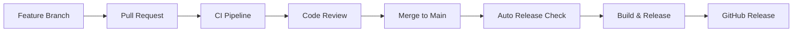

# 🔄 GitHub Actions 워크플로우 가이드

> **X.com Enhanced Gallery의 CI/CD 파이프라인 및 자동화 워크플로우**

## 📋 워크플로우 개요

### 🚀 메인 워크플로우

| 워크플로우            | 트리거            | 목적           | 실행 시간 |
| --------------------- | ----------------- | -------------- | --------- |
| **CI Pipeline**       | Push, PR          | 코드 품질 검증 | ~5분      |
| **Build and Release** | Release, Tag      | 프로덕션 빌드  | ~8분      |
| **Auto Release**      | Main Push         | 자동 릴리스    | ~10분     |
| **Code Quality**      | 코드 변경, 주간   | 품질 분석      | ~15분     |
| **Security Audit**    | 의존성 변경, 주간 | 보안 검사      | ~5분      |
| **Documentation**     | 문서 변경         | 문서 업데이트  | ~3분      |

## 🔧 상세 워크플로우

### 1. CI Pipeline (`.github/workflows/ci.yml`)

**트리거**: 모든 브랜치 Push, PR
**목적**: 빠른 코드 품질 검증

```yaml
on:
  push:
    branches: [main, develop, feature/*]
  pull_request:
    branches: [main, develop]
```

**실행 단계**:

1. **품질 검사**: `npm run quality`

   - TypeScript 타입 검사
   - ESLint 검사
   - Prettier 포맷 검사
   - 유닛 테스트 + 커버리지
   - 의존성 구조 검증

2. **빌드 테스트**: `npm run build:dev`
3. **커버리지 업로드**: Codecov

### 2. Build and Release (`.github/workflows/build-and-release.yml`)

**트리거**: Release 이벤트, Main 브랜치, Tag
**목적**: 프로덕션 빌드 및 릴리스

**실행 단계**:

1. **품질 검사**: 전체 품질 검증
2. **매트릭스 빌드**: Development + Production 모드
3. **빌드 검증**: 스크립트 유효성 검사
4. **릴리스 생성**: 자동 태그 및 에셋 업로드

**아티팩트**:

- `xcom-enhanced-gallery.user.js` - 메인 유저스크립트
- `xcom-enhanced-gallery-v*.user.js` - 버전별 유저스크립트
- `checksums.txt` - SHA256 체크섬

### 3. Auto Release (`.github/workflows/auto-release.yml`)

**트리거**: Main 브랜치 코드 변경
**목적**: 자동 버전 관리 및 릴리스

**기능**:

- **자동 감지**: `package.json` 버전 변경 감지
- **수동 트리거**: 버전 타입 선택 (patch/minor/major/prerelease)
- **자동 릴리스**: 태그 생성 및 GitHub Release

```bash
# 수동 릴리스 트리거
gh workflow run auto-release.yml -f version_type=minor
```

### 4. Code Quality (`.github/workflows/code-quality.yml`)

**트리거**: 코드 변경, 주간 스케줄
**목적**: 심화 코드 품질 분석

**생성 리포트**:

- **의존성 그래프**: SVG 시각화
- **의존성 분석**: HTML 리포트
- **빌드 메트릭스**: 번들 크기, 성능 지표

### 5. Security Audit (`.github/workflows/security.yml`)

**트리거**: 의존성 변경, 주간 스케줄
**목적**: 보안 취약점 검사

**검사 항목**:

- **npm audit**: 의존성 취약점
- **라이선스 검사**: 허용된 라이선스만 사용
- **패키지 업데이트**: 오래된 패키지 체크

### 6. Documentation (`.github/workflows/docs.yml`)

**트리거**: 문서 변경
**목적**: 문서 자동 업데이트

**기능**:

- **의존성 문서**: 자동 생성 및 커밋
- **Markdown 검증**: 링크 체크, 포맷 검증

## 🔧 워크플로우 설정

### 필수 시크릿

```bash
# GitHub Secrets 설정
CODECOV_TOKEN=<your-codecov-token>    # 커버리지 업로드
```

### 브랜치 보호 규칙

```yaml
# main 브랜치 보호
required_status_checks:
  - CI Pipeline / validate
  - Build and Release / quality-check
  - Build and Release / build-test (development)
  - Build and Release / build-test (production)

required_pull_request_reviews:
  required_approving_review_count: 1
  dismiss_stale_reviews: true

enforce_admins: true
allow_force_pushes: false
allow_deletions: false
```

## 📊 성능 최적화

### 캐시 전략

```yaml
# Node.js 의존성 캐시
- uses: actions/setup-node@v4
  with:
    cache: 'npm'
    cache-dependency-path: package-lock.json
```

### 병렬 실행

- **매트릭스 빌드**: Development/Production 동시 실행
- **독립적 Job**: 의존성 없는 작업 병렬 처리

### 아티팩트 최적화

- **보존 기간**: 개발용 7일, 릴리스용 30일
- **압축**: 자동 압축으로 전송 시간 단축

## 🚀 배포 프로세스

### 1. 개발 → 릴리스



### 2. 수동 릴리스

```bash
# 1. package.json 버전 업데이트
npm version patch|minor|major

# 2. 변경사항 커밋 및 푸시
git push

# 3. 자동 릴리스 트리거됨
```

### 3. 수동 워크플로우 트리거

```bash
# GitHub CLI 사용
gh workflow run auto-release.yml -f version_type=minor
gh workflow run code-quality.yml
gh workflow run security.yml

# GitHub 웹 인터페이스
# Actions > 워크플로우 선택 > Run workflow
```

## 🔍 모니터링 및 알림

### 워크플로우 상태 확인

```bash
# 최근 워크플로우 실행 상태
gh run list --limit 10

# 특정 워크플로우 상태
gh run list --workflow="CI Pipeline"

# 워크플로우 로그 확인
gh run view <run-id> --log
```

### 실패 시 대응

1. **CI 실패**: 로그 확인 후 코드 수정
2. **빌드 실패**: 의존성 또는 설정 문제 확인
3. **보안 취약점**: `npm audit fix` 실행
4. **문서 오류**: 마크다운 포맷 수정

## 📋 체크리스트

### 새 기능 개발 시

- [ ] Feature 브랜치에서 개발
- [ ] CI Pipeline 통과 확인
- [ ] 커버리지 유지/개선
- [ ] 문서 업데이트
- [ ] PR 생성 및 리뷰

### 릴리스 준비 시

- [ ] 모든 테스트 통과
- [ ] 보안 감사 통과
- [ ] 문서 최신화
- [ ] 버전 번호 업데이트
- [ ] 체인지로그 작성

### 정기 유지보수

- [ ] 주간 보안 감사 결과 확인
- [ ] 의존성 업데이트 검토
- [ ] 성능 메트릭 분석
- [ ] 문서 정확성 검증

---

> **💡 팁**: GitHub Actions 대시보드에서 모든 워크플로우 상태를 한눈에 확인할 수 있습니다.
> **🔧 문제 발생 시**: [GitHub Actions 트러블슈팅 가이드](https://docs.github.com/en/actions/monitoring-and-troubleshooting-workflows) 참고
